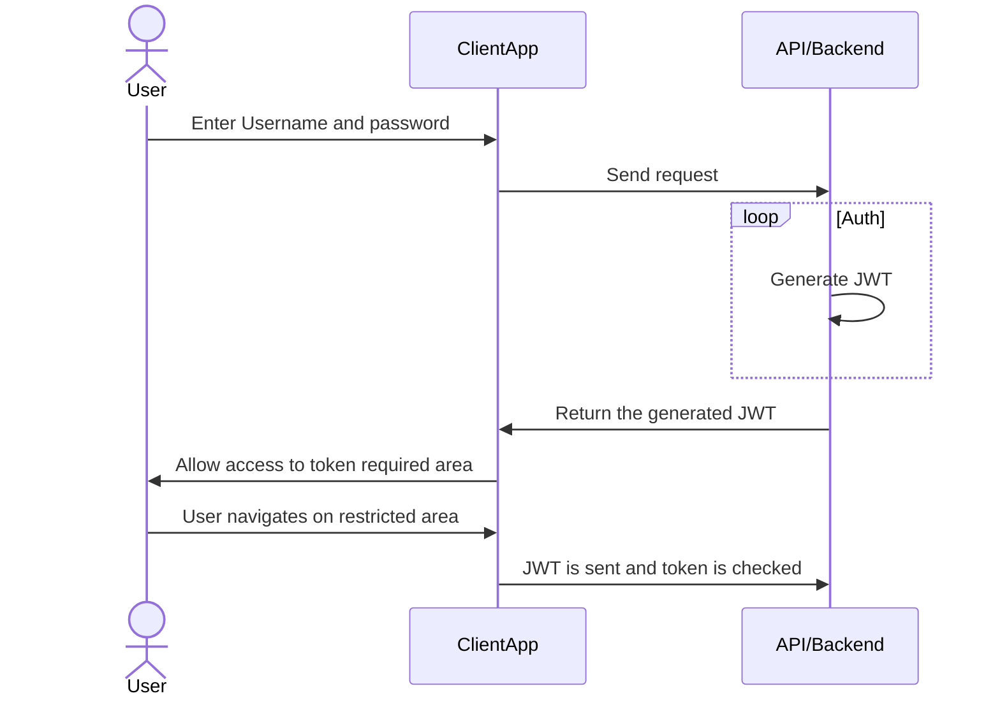

# arbetsgrupp

### Petras försök

```mermaid
sequenceDiagram
	actor User
	participant ClientApp
	participant API/Backend

	User->>ClientApp: Enter Username and password
	ClientApp->>API/Backend: Send request
	Loop Auth
		API/Backend->>API/Backend: Generate JWT
	end
	API/Backend->>ClientApp: Return the generated JWT
	ClientApp->>User:Allow access to token required area
	User->>ClientApp: User navigates on restricted area
	ClientApp->>API/Backend: JWT is sent and token is checked
```
