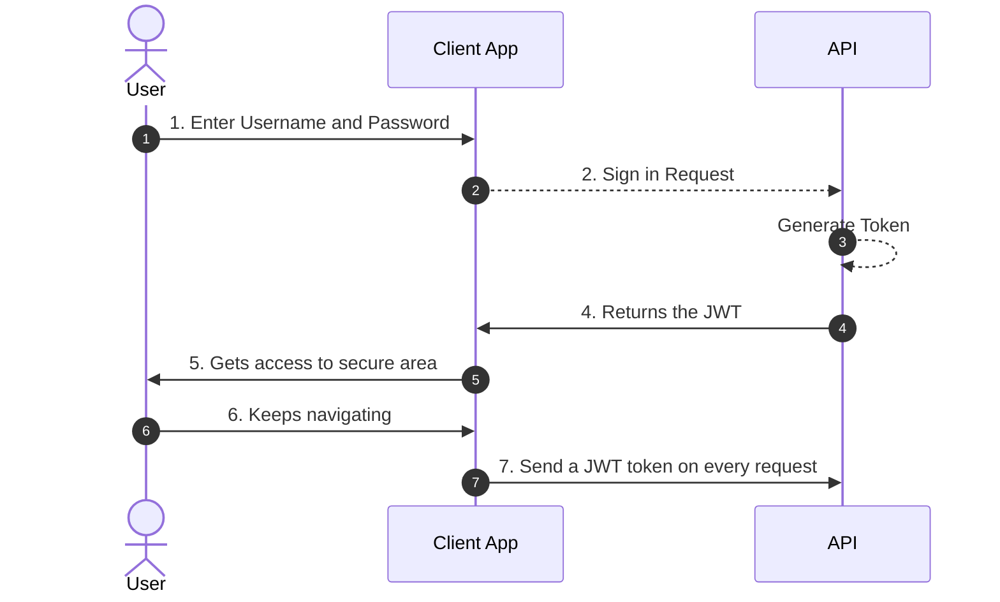

```mermaid
sequenceDiagram

Actor User
    autonumber
    User->>Client App: 1. Enter Username and Password
    Client App-->>API: 2. Sign in Request
    
    API-->>API: Generate Token
    
    
    
    API->>Client App: 4. Returns the JWT
    Client App->>User: 5. Gets access to secure area
    User->>Client App: 6. Keeps navigating
    Client App->>API: 7. Send a JWT token on every request
    
   
```
